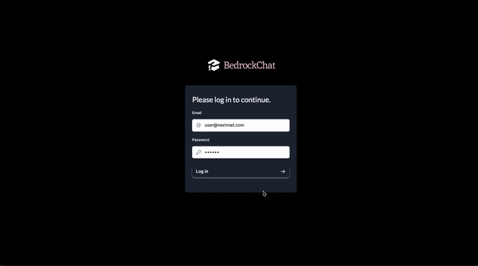
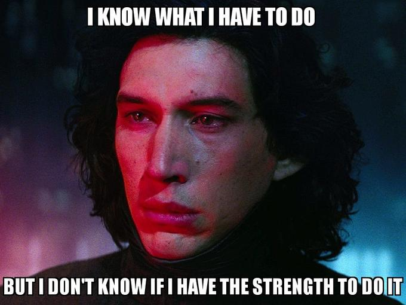

# BedrockChat: Full Stack RAG Implementation using AWS 
An ongoing implementaion of a full stack RAG application similar to ChatPDF powered completely by Amazon Bedrock models.

Frontend: NextJS, Tailwind

AWS Services: Amazon Bedrock, AWS Lambda, API Gateway

Database: Vercel (only used for storage, the deployed version does not work), PostgreSQL

How the RAG app works:
1. Allow user to create and delete files, files are automatically converted to FAISS embeddings and subsequently stored based on user ID and file name. 

Current supported files: docx, pdf.

2. Allow user to query about the files and select the Amazon Bedrock models available to use.

Current look:

    

- [x] User authentication using NextJS.
- [x] Frontend screens for login, dashboard, chatbot and files.
- [x] Lambda endpoint to store FAISS embeddings in S3 bucket.
- [x] Lambda endpoint to enable user to chat with RAG model by retrieving stored embeddings as context.
- [] Enable user to query about more than one unrelated files at once.
- [] Implement a more [production-ready RAG](https://docs.llamaindex.ai/en/stable/optimizing/production_rag.html).

And many many more things that I need to add 😮‍💨.

    

# BedrockChat
